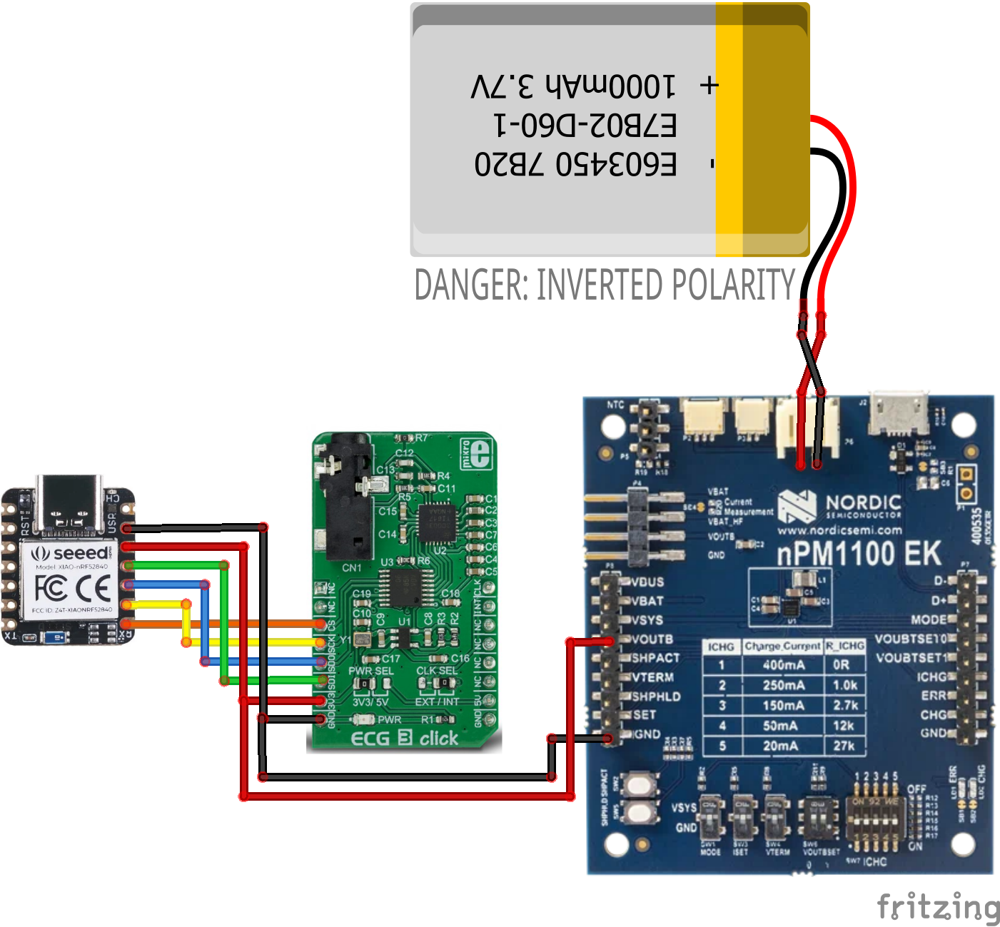
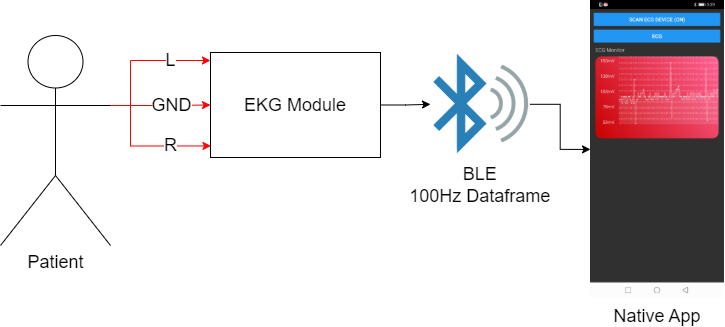
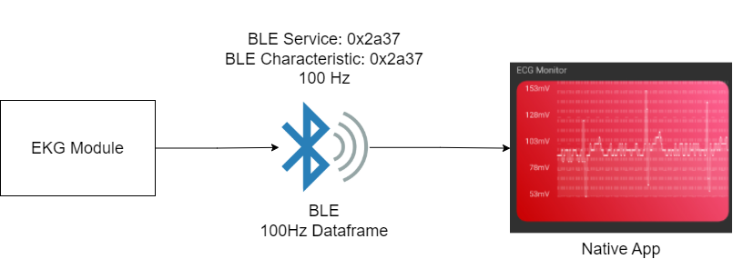
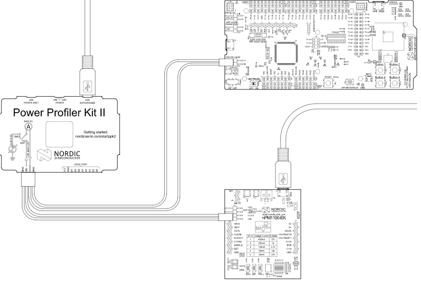
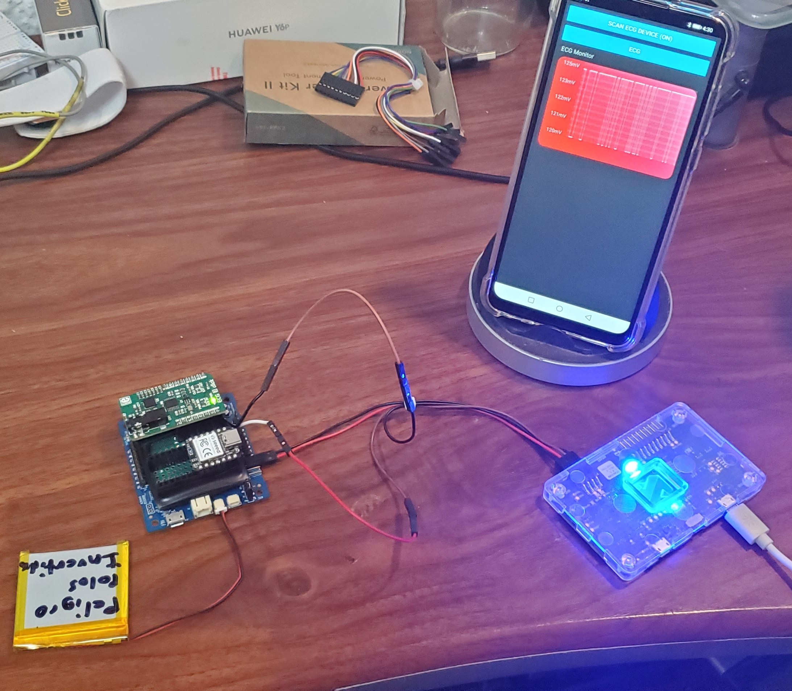
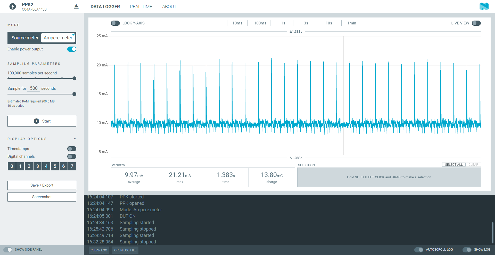
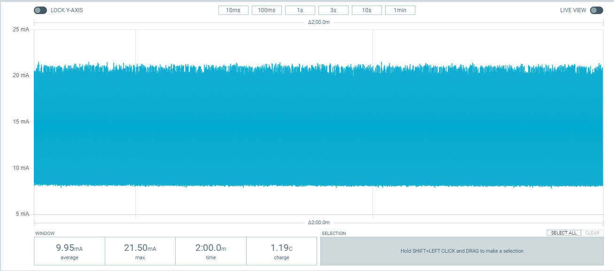

# Nordic-BLE-EKG
 
This is the main repository for the npm1100 evaluation Kit by Nordic.

# Components:

All components are designed to be used with the Nordic ecosystem and to be energy efficient.

- [nPM1100 EK](https://www.nordicsemi.com/Products/Development-hardware/nPM1100-EK)
- [XIAO nRF52840](https://www.seeedstudio.com/Seeed-XIAO-BLE-nRF52840-p-5201.html)
- [ECG 3 click](https://www.mikroe.com/ecg-3-click)
- LiPo Battery 3.7v, 4.2v max, 1C

NOTE: due to a manufacturing defect the polarity of the battery port is reversed, so if you wish to use the same nPM1100 for this project remember to reverse the polarity of the connector as shown in the diagram, otherwise you run the risk of making a big mistake. Short circuits are not fun. This was just the case of MY OWN npm device, you have to check the polarity of your own if you wish to replicate this project.

DISCLAIMER: This application is used for demonstrative and illustrative purposes only and does not constitute an offering that has gone through regulatory review. It is not intended to serve as a medical application. There is no representation as to the accuracy of the output of this application and it is presented without warranty.

# Introduction to this series

Welcome to this three part series. This series aims to take certain Developer Kit component, namely the Excellent npm1100 Evaluation Kit to manage power, an NRF dev kit and some other miscelaneous components and build a complete IoT device. In this case we will be building an Electrocardiograph based on a past project, but we will take it as far as we can.

The series will be divided into:

Part 1: HARDWARE: Dev kit integration, system's architecture and component development.

Part 2: SOFTWARE: Mobile App development and some AI and cloud integration.

Part 3: FUNCTIONAL PROTOTYPE: We will go ahead and design, order and print a PCB within that System's architecture, test it and complete a much more robust prototype.

Hopefully part three of this series will coincide with the market release of the npm1100 and we can go ahead and maybe go forward with this prototype and try to get it into a final stage and maybe even launch it. This of course covering everything from licences, certifications and all that process. But, for the moment let's get to the first part.

# A little bit on the problem and why it is important to quantify health markers.

Our heart beats 115200 times a day, it is such a fine machine that does not stop during our lives. However, not many people have the advantage to have this machine in good conditions. Many factors of daily life can permanently affect cardiac function.

Factors such as:

Sedentarism.
Diet full of Salt, saturated fats and refined sugar.
Alcoholic intake.
Smoking
High blood pressure
Obesity
Family history of heart disease
History of a previous heart attack
Sge over 45 for men, or over 55 for women
Male gender (there's a direct correlation for cardiovascular disease)
Substance abuse
Low potassium or magnesium
This brings us to our pain point:

Quite a lot of people have to undergo cardiac tests frequently in expensive hospitals with gigantic measuring devices. We are in a time where open health is stronger than ever and it is time to make the patient the point of care.

The market for electrocardiography is quite enormous, as it has become the standard for patients with heart risks.

What we can see in this graphic is that most of the electrocardiographs are those big machines (as a Biomedical Engineer I can attest that most, are quite old). In addition to this most in the "holter" category are not really wearables but smaller ones that can be carried despite that a wearable one that can be used at home could provide invaluable information about the patient's heart.

One thing that we have to notice first. The first of wearables has already come out in the market and the results are not that great. The main issue that Doctors put forth is that it is too much information, think of the internet before data aggregators, it has no value if it cannot be interpreted correctly and that is something that has to be taken into consideration. A solution should aggregate all that data and provide carers with useful information.

## Second Problem
This brings us to the second problem that is quite basic, most EKG machines whether they are Holter's or Rest EKGs use gel-based electrodes. These are completely unusable in an athletic environment i.e. Athletes trying to measure themselves during activity. For these reasons we will try while developing the IoT device, to develop at the same time Dry electrodes.

# Design:

This is the connection diagram of the components separately from the circuit if you want to do it in a modular way with these pieces, however, a PCB will be made soon with all the components on it on part 3 of this series.

- Communication with the ECG is done through the SPI protocol, unlike other more economical modules such as the AD8232 that are handled with analog readings and occupy an ADC.
- The power that we are supplying with the nPM1100 EK is 3v, which is the maximum voltage that the EK supplies.

Basically, through the nRF gateway and cloud we get the signals from our microcontroller, we clean it a bit and then send it to our dashboard.

The EK configuration is as follows.

# Connection Diagram:

To use the device, an ECG cable connected to the arms was connected to the ECG module, which has a Jack input, later this through BLE sends the data at a frequency of 100Hz to the app to be able to visualize a coherent graph.

Due to the fact that this is a device that we are going to be using for long periods of time and it is also a device that must be used every day, we can understand that the use of disposable electrodes is not feasible. So that's why we decided to make our own dry electrodes.

Materials:

- Copper Plate.
- Silver Conductive Ink.
- Electrode External Snap.

## Electrode arrangement
In order to read the EKG and also make the device as comfortable as possible, we take into consideration the arrangement of Electrodes of the AppleWatch

CR Apple Computers

First we place two electrodes on the right hand and one on the left hand as follows.

Right:

Left:

Ground:

With this arrangement of electrodes we can obtain an ECG signal that while not perfect, we can fix with a little processing.

# BLE Service:

All ECG information is sent at a frequency of 100Hz to the device that is connected to it.

- BLE Service:
  - Name: ECG
  - UUID: 0x2a37
  - BLE Characteristic:
    - UUID: 0x2a37
    - Properties:
      - Read
      - Notify
    - Value:
      - 8-bit unsigned int.

# Power consumption:

Within the official documentation they indicate how to read the current consumption of the nPM with the PPKII.

[Nordic Official Documentation](https://infocenter.nordicsemi.com/index.jsp?topic=%2Fug_npm1100_ek%2FUG%2FnPM1100_EK%2Fppk2_current_measurement.html)

The power consumption of our entire design is less than 10mAh, as can be seen in our measurements with the PPKII.

- Connection of the POC to the PPKII in Ampere Meter mode.

- Device measurements, we have peaks of 20mA due to the reading of the ECG data every 10ms.

- Here is a 2 min consumption test.
- 

# Proof of Concept:

Finally we put everything in a 3D printed case for the moment so we can test it.

Here is a video demo:

# End of Part 1 and Next steps:

As a three part series this is just the initial design, component selection, showcase of the npm1100

